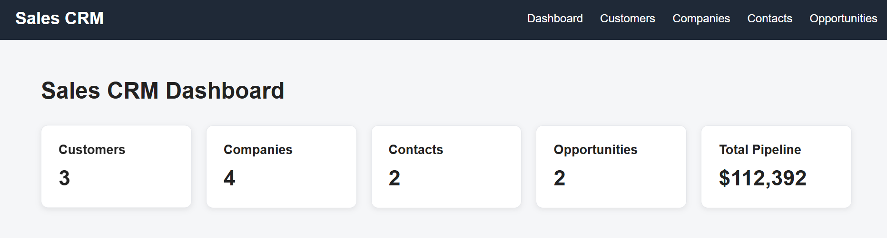
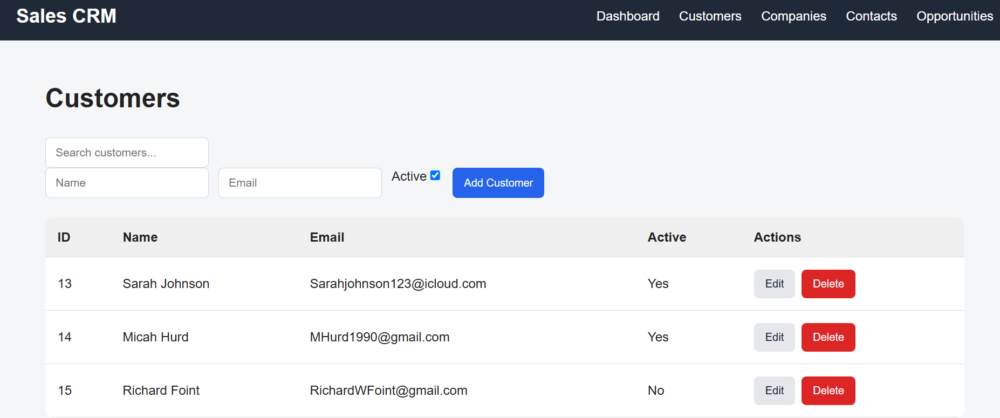
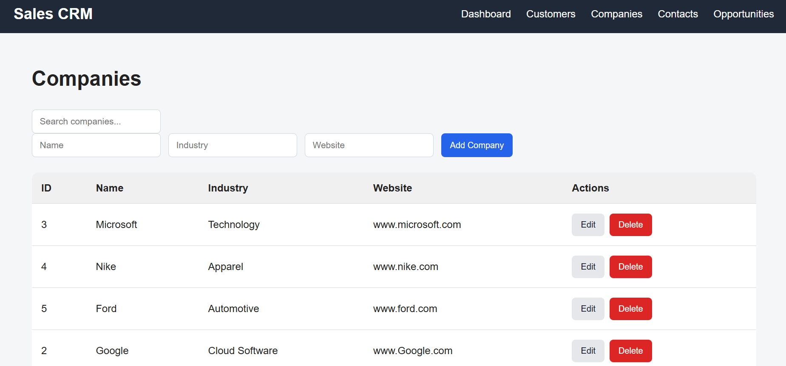
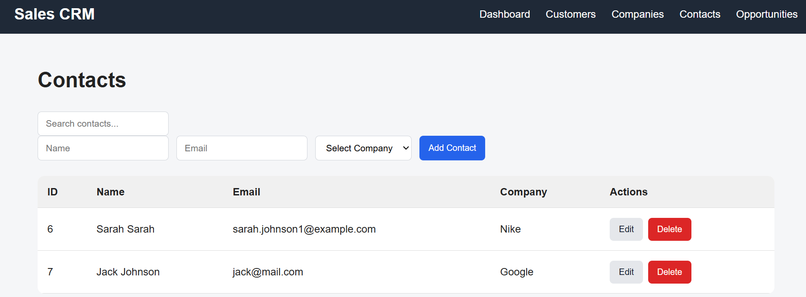
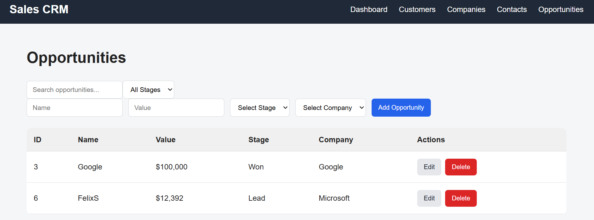

# Sales CRM

A full-stack Customer Relationship Management (CRM) application for managing customers, companies, contacts, and sales opportunities.

The application includes a React frontend connected to a FastAPI backend and PostgreSQL database. It supports creating, viewing, updating, deleting, searching, and filtering CRM data through a web interface.

## Features

- Customer management
- Company management
- Contact management with company relationships
- Sales opportunity tracking
- Opportunity stage tracking (Lead, Qualified, Proposal, Won, Lost)
- Search and filtering
- Sales pipeline value tracking
- Dashboard with CRM statistics
- Form validation and error handling
- Persistent PostgreSQL database storage

## Tech Stack

### Frontend
- React
- JavaScript
- React Router
- HTML
- CSS

### Backend
- Python
- FastAPI
- SQLAlchemy

### Database
- PostgreSQL

### Development Tools
- Git
- GitHub
- VS Code
- pgAdmin

## Project Structure

The application is split into a React frontend and a FastAPI backend.

- **Frontend:** Handles the user interface, navigation, forms, search, filtering, and API requests.
- **Backend:** Provides REST API endpoints and handles application logic.
- **Database:** PostgreSQL stores customers, companies, contacts, and opportunities.
- **SQLAlchemy:** Connects the FastAPI backend to PostgreSQL and manages database models.

## API Endpoints

The FastAPI backend provides RESTful endpoints for managing CRM data.

### Customers
- `GET /customers/` - View all customers
- `POST /customers/` - Create a customer
- `PATCH /customers/{id}` - Update a customer
- `DELETE /customers/{id}` - Delete a customer

### Companies
- `GET /companies/` - View all companies
- `POST /companies/` - Create a company
- `PATCH /companies/{id}` - Update a company
- `DELETE /companies/{id}` - Delete a company

### Contacts
- `GET /contacts/` - View all contacts
- `POST /contacts/` - Create a contact
- `PATCH /contacts/{id}` - Update a contact
- `DELETE /contacts/{id}` - Delete a contact

### Opportunities
- `GET /opportunities/` - View all opportunities
- `POST /opportunities/` - Create an opportunity
- `PATCH /opportunities/{id}` - Update an opportunity
- `DELETE /opportunities/{id}` - Delete an opportunity

## How to Run

### Backend

1. Create and activate a Python virtual environment.

2. Install the required Python packages.

3. Create a `.env` file and add your PostgreSQL database connection:

   `DATABASE_URL=your_database_url`

4. Start the FastAPI server:

   `uvicorn main:app --reload --port 8001`

5. The API will run at `http://127.0.0.1:8001`.

### Frontend

1. Navigate to the frontend directory.

2. Install the dependencies:

   `npm install`

3. Start the React development server:

   `npm run dev`

4. Open the local URL provided by the development server in your browser.

## Screenshots

### Dashboard

### Customers

### Companies

### Contacts

### Opportunities

## Future Improvements

- User authentication and authorization
- Sales analytics and reporting
- Opportunity pipeline visualization
- Improved responsive design
- Cloud deployment